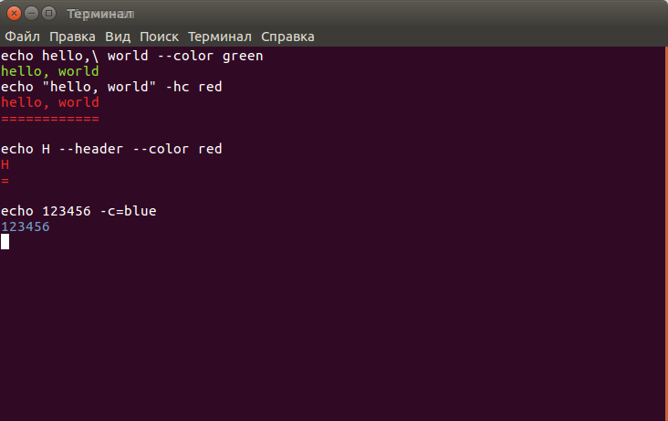

# Bash.NET



[Download](https://github.com/girvel/BashDotNet/raw/master/BashDotNet/bin/Release/BashDotNet.dll)

## Creating commands

Library definition:

```C#
library = new Library(2,
library = new Library(2,
    new Command(
        "echo write", new[] { "text" },
        new[] { 
            new Option("color", "color", 'c'),
            new Option("header", "header", 'h'),
        },
        (args, opts) =>
        {
            switch (opts["color"])
            {
                case "red":
                    Console.ForegroundColor = ConsoleColor.Red;
                    break;

                case "green":
                    Console.ForegroundColor = ConsoleColor.Green;
                    break;

                case "blue":
                    Console.ForegroundColor = ConsoleColor.Blue;
                    break;
            }

            Console.WriteLine(args["text"]);
            if (opts["header"] == "true")
            {
                Console.WriteLine(new string('=', args["text"].Length) + '\n');
            }

            if (opts["color"] != "false")
            {
                Console.ResetColor();
            }
        }));
```

Execution:

```C#
if (!library.TryExecute(Console.ReadLine()))
{
    Console.WriteLine("wrong command");
}
```

Output:

```bash
$ echo "hello 'world'" -hc=red
hello 'world'
=============
```

Also you can create commands with longer names:

```C#
interpreter = new Interpreter(2,
    new Command(
        "echo write", new[] { "text" },
// ...
```

Output:

```bash
$ echo write "hello world" -hc=red
hello world
===========
```

